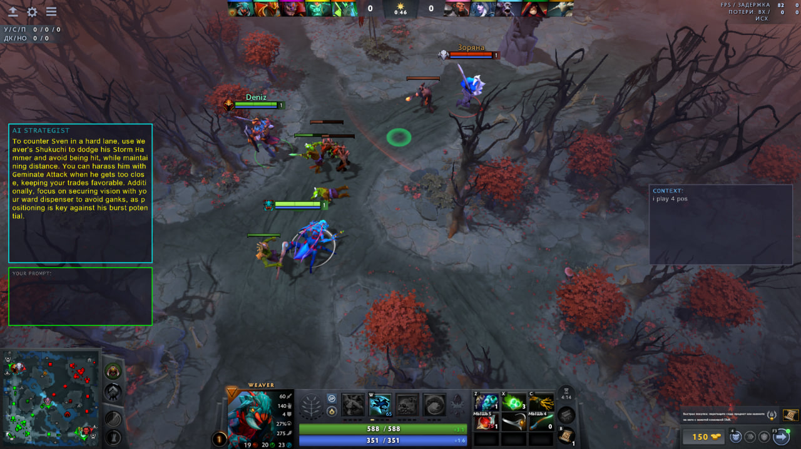

# Dota 2 AI Coach

An intelligent AI assistant for Dota 2 that analyzes game situations in real-time and provides tactical advice through an overlay. The system uses RAG (Retrieval-Augmented Generation) for more relevant and well-grounded responses.



## Features

- 🎮 **Dota 2 Integration** via GSI (Game State Integration)
- 🤖 **AI Provider Support:** Google Gemini and OpenRouter
- 🔍 **RAG System:** Searches relevant information from knowledge base before generating responses
- 💬 **Automatic Advice** every N seconds
- ❓ **Interactive Questions** directly in-game
- ⌨️ **Hotkey Management**
- 📚 **Built-in Knowledge Base** with information about heroes, abilities, items

## Requirements

- **Go** 1.24.0+
- **Windows** (uses WinAPI)
- **Dota 2**
- **API key** from Gemini or OpenRouter

## Installation
```bash
# Clone the repository
git clone https://github.com/BrightGir/game-ai-helper.git
cd GameHelper

# Download dependencies
go mod tidy
```

## Configuration

### 1. API Key

Create a `.env` file in the project root directory:
```env
API_KEY=your_api_key_here
MODELS_DIR=storage (or folder where the BERT model will be located)
```

**Where to get an API key:**
- **Gemini**: https://makersuite.google.com/app/apikey 
- **OpenRouter**: https://openrouter.ai/keys (paid models, some free options available)

> 💡 **Tip:** For best results, use advanced models. Free models work well for basic advice.

### 2. Dota 2 GSI Configuration

Before using the application, you need to configure Dota 2 to send game data to GameHelper:

1. **Locate your Dota 2 GSI config folder:**
```
   C:\Program Files (x86)\Steam\steamapps\common\dota 2 beta\game\dota\cfg\gamestate_integration\
```

> 💡 **Tip:** If the `gamestate_integration` folder doesn't exist, create it manually.

2. **Create a new file** in this folder named:
```
   gamestate_integration_aicoach.cfg
```

3. **Copy and paste** the following content into the file:
```cfg
   "Dota 2 Integration Configuration"
   {
       "uri"           "http://localhost:6000"
       "timeout"       "5.0"
       "buffer"        "0.1"
       "throttle"      "0.1"
       "heartbeat"     "30.0"
       "data"
       {
           "provider"      "1"
           "map"           "1"
           "player"        "1"
           "hero"          "1"
           "abilities"     "1"
           "items"         "1"
       }
   }
```

4. **Save the file** and restart Dota 2 if it's already running.

### 3. Application Settings

Edit `config.json`:
```json
{
  "local_gsi_port": 6000,
  "provider": "openrouter",
  "model": "openai/gpt-4o-mini",
  "request_interval_seconds": 60,
  "silence_duration_seconds": 60,
  "hotkey_turn_overlay": 120,
  "hotkey_focus_overlay": 121,
  "minSimilarity": 0.7
}
```

**Parameters:**
- `local_gsi_port` — port for GSI server (default 6000)
- `provider` — `"gemini"` or `"openrouter"`
- `model` — AI model:
    - **Gemini**: `gemini-2.5-flash`, `gemini-2.5-pro`
    - **OpenRouter**: `google/gemma-3-27b-it:free`, `meta-llama/llama-3.2-3b-instruct:free`, `openai/gpt-4o-mini`
- `request_interval_seconds` — automatic advice interval (seconds)
- `silence_duration_seconds` — pause after question before auto-advice (seconds)
- `hotkey_turn_overlay` — toggle overlay key (120=F9)
- `hotkey_focus_overlay` — focus key (121=F10)
- `minSimilarity` — minimum similarity threshold for RAG search (default 0.7)

> ⚠️ **Important:** Advice quality depends on the model. Advanced models provide significantly better results.

## Usage 🎮

### First Launch

**Development mode:**
```bash
go run ./cmd/game-helper
```

**Or build and run:**
```bash
# Build
go build -o GameHelper.exe ./cmd/game-helper

# Run
./GameHelper.exe
```

**What happens on first run:**
1. BERT models for embedding are downloaded (may take a few minutes)
2. Knowledge base is indexed in Chroma DB.
3. You will see overlay
4. Subsequent runs will be faster (uses cache)

**Keep the console window open** — closing it will stop the application.

### Starting Dota 2

1. Launch Dota 2 in **Windowed Mode** (Settings → Video → Display Mode → Borderless Window)

> ⚠️ **IMPORTANT:** Dota 2 **must be running in Windowed Mode** (not Fullscreen) for the overlay to work correctly.

### Using the Overlay

The overlay consists of three main areas:

1. **AI Advice Panel** — Shows automatic tactical advice and AI responses
2. **Question Input Field** — Type your questions here
3. **Context Input Field** — Add additional game context/notes

### Hotkeys Reference

| Key | Action | Description |
|-----|--------|-------------|
| `F9` | Toggle Overlay | Show or hide the entire overlay |
| `F10` | Focus Overlay | Enable/disable text input mode (allows typing) |
| `Enter` | Submit | Send your question or save context |

### How to Ask Questions

1. **Press `F10`** to focus the overlay (you'll see the input fields become active)
2. **Click on the Question Input Field**
3. **Type your question**, for example:
    - "What items should I buy next?"
    - "How do I counter this hero?"
    - "What's the best strategy for this situation?"
4. **Press `Enter`** to send the question
5. The AI will process your question and display the answer in the **AI Advice Panel**

### Adding Game Context

You can provide additional context to help the AI give better advice:

1. **Press `F10`** to focus the overlay
2. **Click on the Context Input Field** (bottom section)
3. **Type relevant information**, for example:
    - "Enemy team has strong magic damage"
    - "I'm playing as support"
4. This context will be included in all future AI requests

### Automatic Advice

The application automatically provides tactical advice every **N seconds** (configured in `config.json` as `request_interval_seconds`, default: 60 seconds).

- Advice appears automatically in the **AI Advice Panel**
- The system analyzes your current game state (hero, items, abilities, gold, etc.)
- Advice pauses for **N seconds** after you ask a manual question (configured as `silence_duration_seconds`)

## Architecture
```
┌─────────────────────────────────────────────────────┐
│            Dota 2 Game Client                       │
│  (Sends Game State)                                 │
└────────────────┬────────────────────────────────────┘
                 │ HTTP POST (JSON)
                 ▼
    ┌────────────────────────────┐
    │   GSI Handler              │
    │  (transport/http_gsi.go)   │
    │   localhost:6000           │
    └────────┬───────────────────┘
             │
             ▼
    ┌────────────────────────────┐
    │   Parser                   │
    │  (dota/parser.go)          │
    │  JSON → GameState          │
    └────────┬───────────────────┘
             │
             ▼
    ┌────────────────────────────┐
    │   Store (Thread-safe)      │
    │  (state/store.go)          │
    │  RWMutex + GameState       │
    └────────┬───────────────────┘
             │
             │ Reads state
             ▼
┌──────────────────────┐              ┌───────────────────┐
│  Prompt Handler      │              │  Overlay (UI)     │
│ (prompt.go)          │◄─────────────│ (ui/*.go)         │
│                      │ userPromptChan                   │
│ • Timer (auto)       │              │ • RayLib window   │
│ • User questions     │              │ • Hotkeys         │
└──────────┬───────────┘              │ • Text input      │
           │                          │ • GetContextText()│
           │ Calls Build()            │   (user notes)    │
           ▼                          └─────────┬─────────┘
┌──────────────────────────────────────┐        │
│  Builder (prompt/builder.go)         │◄───────┘
│                                      │  ContextProvider
│  1. store.Get() → GameState          │   (user notes)
│  2. ctxProvider.GetContextText()   │
│  3. Formats: hero, items,            │
│     abilities, user notes            │
│  4. pipeline.Execute()               │
└──────────┬───────────────────────────┘
           │ gameContext + question
           ▼
┌──────────────────────────────────────────────────────┐
│  Pipeline (prompt/pipeline.go)   [RAG SYSTEM]      │
│                                                      │
│  ┌─────────────────────────────────────────────┐     │
│  │ 1. generateSearchQueries()                  │     │
│  │    AI request → JSON with search queries    │────►├──► AI Client
│  └─────────────────────────────────────────────┘     │   (Gemini/OpenRouter)
│                        │                             │
│                        ▼                             │
│  ┌─────────────────────────────────────────────┐     │
│  │ 2. retrieveKnowledge()                      │     │
│  │    Search in vector DB                      │────►├──► Retriever
│  └─────────────────────────────────────────────┘     │   (BERT + Chroma)
│                        │                             │
│                        ▼                             │
│  ┌─────────────────────────────────────────────┐     │
│  │ 3. buildFinalPrompt()                       │     │
│  │    knowledge + gameState + question         │     │
│  └─────────────────────────────────────────────┘     │
└──────────────────────────┬───────────────────────────┘
                           │ finalPrompt (string)
                           ▼
              ┌─────────────────────────┐
              │      promptChan         │
              └────────────┬────────────┘
                           │
                           ▼
┌──────────────────────────────────────────────────────┐
│  AI Worker (ai_worker.go)                            │
│                                                      │
│  fetchAdviceWithRetry():                             │
│  • aiProvider.Ask(systemPrompt, finalPrompt)  ──────►├──► AI Client
│  • Retry logic (3 attempts)                          │   (Gemini/OpenRouter)
│  • Error handling                                    │
└──────────────────────────┬───────────────────────────┘
                           │ advice (AI response)
                           ▼
              ┌─────────────────────────┐
              │      adviceChan         │
              └────────────┬────────────┘
                           │
                           ▼
┌──────────────────────────────────────────────────────┐
│  Advice Consumer (ai_worker.go)                      │
│                                                      │
│  overlay.SetAiAdvice(advice)                         │
└──────────────────────────┬───────────────────────────┘
                           │
                           ▼
              ┌─────────────────────────┐
              │  Overlay displays       │
              │  advice to user          │
              └─────────────────────────┘
```

## Project Structure
```
GameHelper/
├── cmd/
│   ├── game-helper/                   # Main application
│   │   ├── main.go                    # Entry point, initialization
│   │   ├── app.go                     # App structure, coordinates all components
│   │   ├── ai_worker.go               # AI request handler with retry logic
│   │   └── prompt.go                  # Prompt queue and timer management
│   └── rag/                           # RAG system tools
│       ├── base-knowledge-loader/     # Loads JSON knowledge bases and create chunks with LLM
│       ├── knowledge-vectorizer/      # Converts text to vectors and saves to Chroma
│       └── prompt-debug/              # Debug tool for running prompt scenarios
├── internal/
│   ├── ai/                            # AI provider integration
│   │   ├── gemini/                    # Google Gemini API client
│   │   │   ├── client.go              # Sends requests to Gemini API
│   │   │   └── types.go               # Request/response structures
│   │   ├── openrouter/                # OpenRouter API client
│   │   │   ├── client.go              # Sends requests to OpenRouter API
│   │   │   └── types.go               # Request/response structures
│   │   ├── factory/                   # Factory for creating AI clients
│   │   │   └── factory.go             # Selects client based on config
│   │   ├── types.go                   # Common Client interface
│   │   └── errors/                    # API error handling
│   │       └── errors.go              # ShouldRetry, APIError structures
│   ├── dota/                          # Game State Integration (GSI)
│   │   ├── parser.go                  # Parses JSON from Dota 2
│   │   └── types.go                   # GameState, Hero, Items, Abilities types
│   ├── prompt/                        # AI prompt generation using RAG
│   │   ├── builder.go                 # Composes context from state + knowledge
│   │   ├── pipeline.go                # RAG pipeline: queries → search → prompt
│   │   └── templates.go               # Text templates for prompts
│   ├── retriever/                     # Knowledge search (RAG component)
│   │   ├── retriever.go               # Vector search + similarity filtering
│   │   ├── bert.go                    # BERT model initialization
│   │   └── types.go                   # Searcher interface, result types
│   ├── state/                         # Thread-safe game state storage
│   │   └── store.go                   # RWMutex for concurrent access
│   ├── config/                        # Configuration management
│   │   └── config.go                  # Config structure + LoadConfig
│   ├── transport/                     # HTTP handler for GSI data
│   │   └── http_gsi.go                # Receives POST from Dota 2
│   └── ui/                            # Graphical overlay (RayLib)
│       ├── types.go                   # Overlay structure, UI state
│       ├── engine.go                  # Main rendering loop
│       ├── draw.go                    # Text rendering
│       ├── calculator.go              # Layout calculations
│       ├── click.go                   # Windows API for transparency
│       ├── input.go                   # Input handling
│       └── keyboard.go                # Hotkey handling
├── assets/                            # Embedded data and templates
│   ├── data/                          # Knowledge base in JSON
│   │   ├── heroes.json                # Hero descriptions with abilities
│   │   ├── items.json                 # Item descriptions
│   │   └── aghs_desc.json             # Aghanim's upgrades
│   ├── prompts/                       # Text templates for prompts
│   │   ├── base-coach-system-prompt.txt
│   │   ├── bd-queries-generator.txt
│   │   ├── final-prompt.txt
│   │   └── *.txt
│   ├── rag/
│   │   └── knowledge.json             # Combined knowledge base
│   └── embed.go                       # go:embed directives
├── storage/                           # Cache and models (git ignored)
│   └── cache/                         # LLM response cache
│       ├── aghs_desc/
│       ├── heroes/
│       └── items/
├── config.json                        # Application configuration
├── .env                               # API key (create this)
├── gamestate_integration_aicoach.cfg  # Dota 2 GSI config (example)
├── go.mod
├── go.sum
├── README.md
└── LICENSE
```

## Advanced

### RAG Tools

These tools are for developers who want to rebuild or modify the knowledge base.

#### Loading Knowledge
```bash
go run ./cmd/rag/base-knowledge-loader
```

Loads base knowledge (heroes, items, abilities) from JSON files and creates text chunks using LLM.

#### Vectorization
```bash
go run ./cmd/rag/knowledge-vectorizer
```

Converts text knowledge to BERT vectors and stores them in Chroma DB.

#### Prompt Debugging
```bash
go run ./cmd/rag/prompt-debug
```

Outputs generated prompts for debugging purposes.

## License

This project is distributed under the [MIT License](LICENSE).

